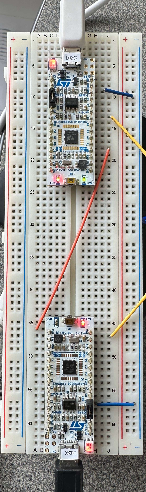

# STM32L432KC-SPI-DMA

Connect two STM32L432KC boards as shown in the photo below. I've set it up so the top board is master and bottom is slave. Note that the yellow (MOSI) wire is connected - just out of frame. 

Note - you'll have to change the S/N of the STLINK debuggers to match what's on your boards.
